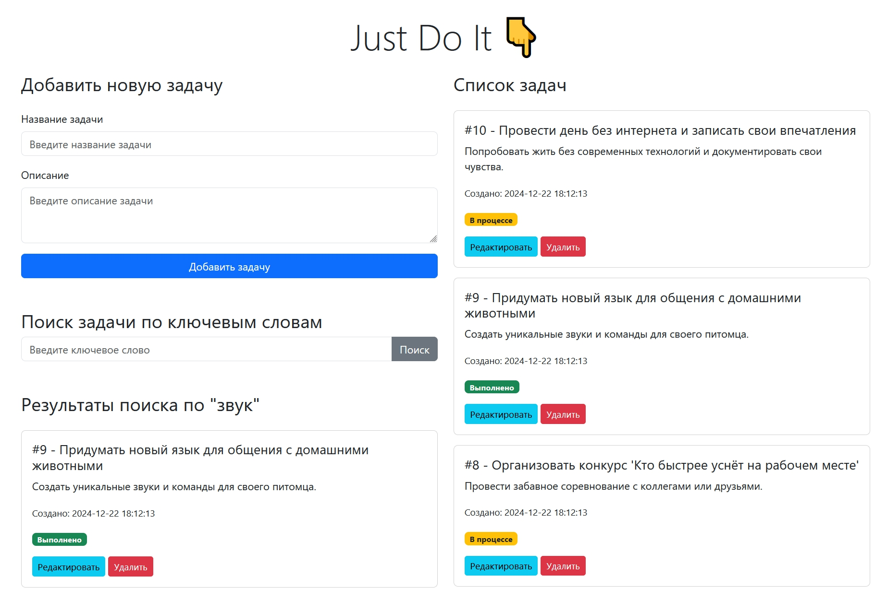

# MS_Lebedeva

# TODO-сервис
Простое веб-приложение для управления задачами на основе FastAPI с веб-интерфейсом и SQLite.



## **Запуск приложения**

### 1. **Локальный запуск**

#### Установка и настройка
1. Склонируйте репозиторий:
    ```bash
    git clone https://github.com/marinaleb81/MS_Lebedeva.git
    cd MS_Lebedeva/Final_work/Todo_app
    ```

2. Убедитесь, что у вас установлен Python версии 3.10 или выше.

3. Создайте и активируйте виртуальное окружение:
    ```bash
    python -m venv venv
    source venv/bin/activate  # Для Linux/MacOS
    venv\Scripts\activate     # Для Windows
    ```

4. Установите зависимости:
    ```bash
    pip install -r requirements.txt
    ```

5. Запустите приложение:
    ```bash
    uvicorn main:app --reload
    ```

6. Откройте браузер и перейдите по адресу: [http://127.0.0.1:5000](http://127.0.0.1:5000).

---

### 2. **Запуск через Docker**

#### Установка и настройка
1. Убедитесь, что Docker установлен и запущен на вашей машине.

2. Соберите Docker-образ:
    ```bash
    docker build -t todo-service .
    ```

3. Запустите контейнер:
    ```bash
    docker run -d --name todo-service -p 5000:5000 todo-service
    ```

4. Откройте браузер и перейдите по адресу: [http://127.0.0.1:5000](http://127.0.0.1:5000).

#### Использование готового образа из Docker Hub

1. Запустите контейнер, используя готовый образ:
    ```bash
    docker run -d --name todo-service -p 5000:5000 marinaleb/todo-service:latest
    ```

2. Откройте браузер и перейдите по адресу: [http://127.0.0.1:5000](http://127.0.0.1:5000).

Docker Hub репозиторий: [marinaleb/todo-service](https://hub.docker.com/repository/docker/marinaleb/todo-service/general)

## **Зависимости**

Установленные библиотеки перечислены в `requirements.txt`:
- FastAPI
- SQLAlchemy
- Uvicorn
- Jinja2
- Passlib
- PyJWT
- Python-dotenv
- Bcrypt
- Python-multipart
- Aiofiles

---

## **Примечания**
- База данных по умолчанию сохраняется в `./data/todo.db`.
- Для изменения конфигурации базы данных обновите `SQLALCHEMY_DATABASE_URL` в файле `database.py`.
- Если возникнут ошибки, используйте `docker logs todo-service` для диагностики.

---

# Доработанная версия v. 1.1

## 1. **Начало работы**
1. Запущен код предоставленный преподавателем
2. Проверена работоспособность всех функций в стандартном интерфейсе FastApi
3. Эндпоинты
- **POST /items**: Создать задачу.
- **GET /items**: Получить список задач.
- **GET /items/{item_id}**: Получить задачу по ID.
- **PUT /items/{item_id}**: Обновить задачу по ID.
- **DELETE /items/{item_id}**: Удалить задачу.
4. **Юнит-тесты**: `pytest_main.py` для тестирования эндпоинтов.

---

## 2. **Подготовка приложения**

### Файлы и их содержимое:
- **`main.py`**: Основной файл приложения.
- **`database.py`**: Настройка подключения к базе данных.
- **`models.py`**: Определение модели `TodoItem` для таблицы `todo_items` в базе данных.
- **`todo.db`**: SQLite база данных.

---

## 3. **Обновление базы данных**
- Добавлено новое поле `created_at` для хранения времени создания задачи:
- Выполнена миграция базы данных через Alembic для обновления структуры таблицы.

---

## 4. **Создание начального интерфейса**
Добавлен базовый HTML-файл `index.html` с Bootstrap:
- Форма для добавления новой задачи.
- Список задач, сортируемый по времени добавления (новые задачи в начале).
- Форма поиска задач по ключевому слову.

---

## 5. **Добавление функционала**

### Новые возможности:
1. **Добавление задачи:**
   - Новые задачи отображаются первыми в списке.
   - Реализовано обновление страницы после добавления.

2. **Удаление задачи:**
   - Добавлена кнопка `Удалить` рядом с каждой задачей.
   - При нажатии происходит удаление задачи из базы данных.

3. **Редактирование задачи:**
   - Добавлена кнопка `Редактировать` для каждой задачи.
   - Реализован диалог для изменения заголовка и описания задачи.

4. **Поиск задач по ключевым словам:**
   - Функция поиска по заголовку или описанию задачи.
   - Используется LIKE-запрос в SQLAlchemy.

---

## 6. **Смешные примеры задач**
С помощью скрипта сгенерированы тестовые данные:
- Пример задач:
  - "Научить кота новым трюкам."
  - "Вырастить дерево из косточки авокадо."
  - "Понять, куда пропадает один носок из пары."

---

## 7. **Исправление ошибок**
- Исправлены баги:
  - Ошибка при добавлении задачи.
  - Некорректная работа поиска по ключевым словам.
  - Несовместимость моделей и структуры базы данных.

---

## 8. **Итог**
На текущий момент приложение готово:
- Поддерживает добавление, удаление, редактирование и поиск задач.
- Обеспечивает удобный интерфейс через HTML-шаблон.
- Работает на SQLite с использованием FastAPI.

🎉 **Работа выполнена успешно!**


